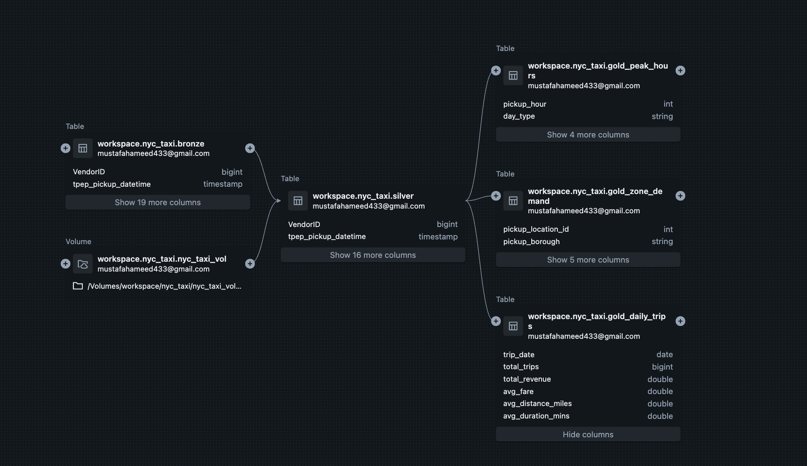

# Project 6 — NYC Taxi Analytics at Scale

> PySpark · Delta Lake · Databricks · Snowflake · dbt Cloud

End-to-end data engineering pipeline processing **259 million NYC TLC Yellow Taxi records (2019–2024, ~50 GB)** — ingestion through Databricks, Delta Lake medallion architecture, Snowflake loading, and dbt incremental marts with automated data quality testing.

---

## Lineage Graph (Unity Catalog)



*Automatically tracked by Unity Catalog: UC Volume + Bronze → Silver → 3 Gold tables*

---

## Architecture

```
NYC TLC CDN (72 Parquet files, ~50 GB)
        │
        ▼
[ Databricks Serverless ]
        │
        ├── 01_ingest    → Unity Catalog Volume (raw Parquet)
        ├── 02_bronze    → Delta Lake (partitioned by year/month)
        ├── 03_silver    → Cleaned + enriched (broadcast join, Z-ORDER)
        ├── 04_gold      → 3 aggregation tables (daily, zone, peak hours)
        └── 05_snowflake → Snowflake NYC_TAXI.GOLD schema
                                │
                        [ dbt Cloud ]
                                │
                        ├── staging/     (views over gold tables)
                        ├── mart_monthly_revenue  (incremental)
                        └── mart_top_zones        (incremental)
                                │
                        15 passing data quality tests
                        Scheduled nightly production job
```

---

## Stack

| Layer | Tool |
|---|---|
| Compute | Databricks Serverless (Community Edition) |
| Storage | Delta Lake on Unity Catalog Volumes |
| Warehouse | Snowflake |
| Transformation | dbt Cloud (incremental models) |
| Orchestration | dbt Cloud scheduled job (nightly_run) |

---

## Key Engineering Decisions

| Decision | Why |
|---|---|
| Per-file read + explicit TARGET_SCHEMA cast | TLC changed column types (DOUBLE→INT64) in 2024 files; `mergeSchema` only handles missing columns, not type conflicts |
| Partition by `(year, month)` | Eliminates full-table scans on time-range queries |
| Z-ORDER on `pickup_location_id` | Co-locates zone data in Delta files → file-level skipping on zone filter queries |
| Broadcast join for zone lookup | 265-row dimension table → broadcasting avoids shuffling the 240M-row fact table across the network |
| `write_pandas` over Maven Spark connector | Maven libraries unavailable on Databricks Serverless; `snowflake-connector-python` works via `%pip` |
| Incremental dbt marts | Only new months are processed on rerun → lower Snowflake credit usage |

---

## Results

| Metric | Value |
|---|---|
| Raw rows ingested | 259,287,888 |
| Silver rows (after cleaning) | ~240M |
| Gold tables | 3 (2,192 + 264 + 48 rows) |
| dbt models | 5 |
| dbt tests passing | 15 / 15 |

See [`docs/benchmarks.md`](docs/benchmarks.md) for full benchmark results and resume bullet.

---

## Project Structure

```
notebooks/
  01_ingest.py          Download 72 TLC Parquet files to UC Volume; validate row counts
  02_bronze.py          Per-file read with explicit type casting; partitioned Delta table; baseline benchmark
  03_silver.py          Clean nulls/outliers; derive trip_duration_mins, fare_per_mile, is_weekend;
                        broadcast join with zone lookup; Z-ORDER; optimized benchmark
  04_gold.py            gold_daily_trips, gold_zone_demand, gold_peak_hours
  05_load_snowflake.py  Load gold tables to Snowflake via snowflake-connector-python

dbt/
  models/staging/       stg_daily_trips, stg_zone_demand, stg_peak_hours (views)
  models/marts/         mart_monthly_revenue (incremental), mart_top_zones (incremental)
  tests/                assert_no_negative_revenue, assert_daily_trips_positive
  dbt_project.yml
  profiles.yml

docs/
  benchmarks.md         Query benchmark results and resume bullet
```

---

## Setup

### Prerequisites

- [Databricks Community Edition](https://community.cloud.databricks.com)
- [Snowflake](https://signup.snowflake.com) (30-day free trial)
- [dbt Cloud](https://cloud.getdbt.com) (free developer tier)

### 1. Snowflake — create database

Run in a Snowflake worksheet before notebook 05:

```sql
CREATE DATABASE IF NOT EXISTS NYC_TAXI;
CREATE SCHEMA  IF NOT EXISTS NYC_TAXI.GOLD;
CREATE SCHEMA  IF NOT EXISTS NYC_TAXI.STAGING;
CREATE SCHEMA  IF NOT EXISTS NYC_TAXI.ANALYTICS;
```

### 2. Databricks — run notebooks in order

1. Clone this repo into Databricks via Repos (Workspace → Repos → Add Repo)
2. Open each notebook and click **Run All** in order:

```
01_ingest → 02_bronze → 03_silver → 04_gold → 05_load_snowflake
```

In `05_load_snowflake.py`, fill in your Snowflake credentials in section 5.1 before running.

### 3. dbt Cloud

1. Create a new project, connect to Snowflake, set subdirectory to `dbt/`
2. Connect your GitHub repo
3. Run in the IDE:
   ```
   dbt run --select staging marts
   dbt test
   ```
4. Create a **Production** environment and **nightly_run** deploy job (scheduled daily)
